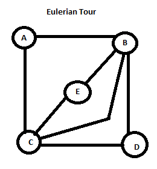
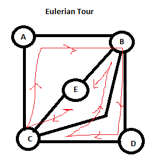

# Puzzles
notes involving interview stuff, graphs, algorithms, etc

- Eulerian Path 
  - degree is the number of edges connected to that node.
  - first and last have to be odd and the rest even.
- Eulerian Tour 
  - start and return to same node
  
  
- Min-max
- Perms and Combs
- Divide and Conquer
- Recurrence relation 
- Linked Lists
- Binary Trees
- Tries
- Stacks
- Queues
- Vectors/ ArrayLists
- Hash Tables 

## Good advice
- Write tests for edge cases (0, negatives, etc)
- Go slowly
- Ask for details (size of data, how contained, what type)
- Remember to be specific and clear when naming variables
- Comment code as needed
- If you find a bug, don't randomly try to fix output. Try to trace *why* it occurrs

